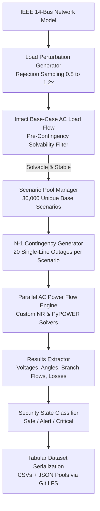

# IEEE 14-Bus Large-Scale Contingency Analysis & Power Flow Engine

[](https://www.python.org/)
[](#)
[-orange.svg)](#3-large-scale-contingency-datasets-600k-cases)
[](#5-git-lfs-tracking--dataset-access)
[-brightgreen.svg)](#8-test-suite--validation)

A high-performance AC power flow simulation, N-1 contingency analysis, and large-scale synthetic dataset generation platform on the IEEE 14-bus transmission system. The framework integrates both a custom vectorized Newton-Raphson AC solver and a PyPOWER reference wrapper, realistic rejection-sampled load variation, rigorous grid security classification, and parallelized multi-dataset campaign generation producing **600,000 post-contingency cases** across 3 distinct tiers.

---

## Table of Contents
1. [Overview & Capabilities](#1-overview--capabilities)
2. [Simulation Architecture & Mathematical Formulation](#2-simulation-architecture--mathematical-formulation)
3. [Large-Scale Contingency Datasets (600k Cases)](#3-large-scale-contingency-datasets-600k-cases)
4. [Dataset Schema & Feature Definitions](#4-dataset-schema--feature-definitions)
5. [Git LFS Tracking & Dataset Access](#5-git-lfs-tracking--dataset-access)
6. [Codebase Architecture & File Reference](#6-codebase-architecture--file-reference)
7. [Installation & Setup](#7-installation--setup)
8. [CLI Usage & Execution Workflows](#8-cli-usage--execution-workflows)
9. [Test Suite & Validation](#9-test-suite--validation)

---

## 1. Overview & Capabilities

Modern power transmission grids are governed by the **N-1 reliability criterion**: the unexpected loss of any individual branch or generator must not cause cascade tripping, thermal overloads, or voltage collapse. 

This platform provides an end-to-end engineering framework for power flow analysis, contingency screening, and dataset synthesis:
* **Dual AC Power Flow Solvers**:
  - **Custom Vectorized Newton-Raphson Solver** (`src/simulation/custom_nr_solver.py`): Pure NumPy/SciPy implementation with exact polar Jacobian calculation, flat-start or warm-start initialization, and per-iteration mismatch tracking.
  - **PyPOWER Wrapper** (`src/simulation/run_load_flow.py`): High-speed MATPOWER/PyPOWER standard reference solver.
* **Realistic Load Synthesis**: Rejection-sampled Latin-hypercube/uniform load multipliers ($\pm 20\%$) across all load buses, conditioned on pre-contingency AC power flow solvability and stability.
* **Exhaustive N-1 Contingency Analysis**: Systematic single-line outage simulation across all 20 branches of the IEEE 14-bus network.
* **Operational Security Labeling**: Standard multi-class classification into **Safe**, **Alert**, and **Critical** states based on IEEE voltage limits and line thermal MVA capacities.
* **High-Throughput Multiprocessing**: Parallel batch execution across CPU worker pools with real-time progress bars, multi-dataset duplicate scenario prevention, and automated manifest auditing.

---

## 2. Simulation Architecture & Mathematical Formulation

### 2.1 Chronological Pipeline



### 2.2 AC Newton-Raphson Load Flow Formulation

Power flow at each bus $i \in \{1, \dots, N\}$ is governed by the nonlinear AC power balance equations in polar coordinates:

$$P_i(V, \theta) = V_i \sum_{j=1}^N V_j \big( G_{ij} \cos(\theta_i - \theta_j) + B_{ij} \sin(\theta_i - \theta_j) \big)$$

$$Q_i(V, \theta) = V_i \sum_{j=1}^N V_j \big( G_{ij} \sin(\theta_i - \theta_j) - B_{ij} \cos(\theta_i - \theta_j) \big)$$

where:
* $V_i, \theta_i$: Voltage magnitude and phase angle at bus $i$.
* $Y_{ij} = G_{ij} + j B_{ij}$: Bus admittance matrix elements.

The iterative Newton-Raphson correction solves the linearized mismatch system:

$$\begin{bmatrix} \Delta P \\ \Delta Q \end{bmatrix} = \begin{bmatrix} J_{11} & J_{12} \\ J_{21} & J_{22} \end{bmatrix} \begin{bmatrix} \Delta \theta \\ \Delta V / V \end{bmatrix}$$

where the Jacobian submatrices are:
* $J_{11} = \frac{\partial P}{\partial \theta}$, $J_{12} = V \frac{\partial P}{\partial V}$
* $J_{21} = \frac{\partial Q}{\partial \theta}$, $J_{22} = V \frac{\partial Q}{\partial V}$

Convergence is achieved when $\max(|\Delta P|, |\Delta Q|) < 10^{-5}\text{ p.u.}$

### 2.3 Grid Security Classification

Each post-contingency operating state is evaluated against standard IEEE operational bounds:

| Security Class | Voltage Magnitude Threshold | Thermal Line Loading Threshold | Grid Condition |
| :--- | :--- | :--- | :--- |
| **Safe** | $0.95 \le V_i \le 1.06\text{ p.u.}$ $\forall i$ | $S_{ij} \le 100\%\text{ MVA}_{\text{limit}}$ $\forall (i, j)$ | Fully compliant; normal operations. |
| **Alert** | $0.90 \le V_i < 0.95$ or $1.06 < V_i \le 1.10$ | $100\% < S_{ij} \le 120\%$ | Minor thermal/voltage excursion; remediation required. |
| **Critical** | $V_i < 0.90\text{ p.u.}$ or $V_i > 1.10\text{ p.u.}$ | $S_{ij} > 120\%\text{ MVA}_{\text{limit}}$ | Severe overload, voltage collapse, or non-convergence. |

---

## 3. Large-Scale Contingency Datasets (600k Cases)

The repository contains **3 comprehensive dataset sets** located in `data/tabular/`, generated under strict non-overlapping scenario constraints:
* **Base Case Filtering**: Intact base-case rows are excluded from the contingency datasets per design; every row corresponds to an active post-contingency line outage response.
* **Zero Duplication**: All 30,000 base loading scenarios are globally unique (verified by `data/tabular/sets_manifest.json`).

| Dataset Tier | Destination Path | Scenarios | Line Outages / Scenario | Total Cases (Rows) | CSV File Size | JSON Pool Size |
| :--- | :--- | :---: | :---: | :---: | :---: | :---: |
| **`dataset_100k`** | `data/tabular/dataset_100k/` | 5,000 | 20 | **100,000** | 91.04 MB | 20.48 MB |
| **`dataset_200k`** | `data/tabular/dataset_200k/` | 10,000 | 20 | **200,000** | 182.08 MB | 40.96 MB |
| **`dataset_300k`** | `data/tabular/dataset_300k/` | 15,000 | 20 | **300,000** | 273.11 MB | 61.44 MB |
| **Grand Total** | — | **30,000** | **20** | **600,000** | **546.23 MB** | **122.88 MB** |

### Label Distribution & Convergence Across Sets

The datasets exhibit balanced, physically realistic distributions:

| Dataset | Total Rows | Converged | Non-Converged | Safe Cases (%) | Alert Cases (%) | Critical Cases (%) |
| :--- | :---: | :---: | :---: | :---: | :---: | :---: |
| **`dataset_100k`** | 100,000 | 95,000 (95.0%) | 5,000 (5.0%) | 36,659 (36.7%) | 28,667 (28.7%) | 34,674 (34.7%) |
| **`dataset_200k`** | 200,000 | 190,000 (95.0%) | 10,000 (5.0%) | 73,796 (36.9%) | 56,852 (28.4%) | 69,352 (34.7%) |
| **`dataset_300k`** | 300,000 | 285,000 (95.0%) | 15,000 (5.0%) | 109,893 (36.6%) | 86,057 (28.7%) | 104,050 (34.7%) |
| **Combined** | **600,000** | **570,000 (95.0%)** | **30,000 (5.0%)** | **220,348 (36.7%)** | **171,576 (28.6%)** | **208,076 (34.7%)** |

> **Note on Non-Convergence**: In the IEEE 14-bus network, outages on specific radial or heavily loaded branches (such as line 1 connecting Bus 1 slack to Bus 2) cause severe voltage instability or islanding under stressed load conditions. These physically unsolvable states are captured faithfully, flagged with `convergence = False`, and classified as `Critical`.

---

## 4. Dataset Schema & Feature Definitions

Each dataset CSV contains **63 columns** representing full post-contingency electrical telemetry:

```text
Columns 1-4   : Case & Contingency Identification
Columns 5-18  : Post-Contingency Bus Voltage Magnitudes (V_bus1 to V_bus14) [p.u.]
Columns 19-32 : Post-Contingency Bus Voltage Phase Angles (angle_bus1 to angle_bus14) [deg]
Columns 33-52 : Transmission Line Loadings (line_loading_1 to line_loading_20) [% of MVA rating]
Columns 53-57 : Generator Active Power Outputs (gen_P_1 to gen_P_5) [MW]
Columns 58-62 : Summary Extremes & Operational Severity
Column 63     : Multi-Class Security Label
```

### Complete Column Breakdown

| Field Name | Data Type | Units / Range | Description |
| :--- | :--- | :---: | :--- |
| `case_id` | `string` | — | Unique case identifier (e.g. `dataset_100k_sc00001_line_1-2`) |
| `contingency_type` | `string` | — | Element outaged (`line`) |
| `contingency_element`| `string` | — | Outaged branch designation (e.g. `branch_1`, `branch_2`) |
| `convergence` | `boolean` | `True / False` | AC power flow solver convergence flag |
| `V_bus1` – `V_bus14` | `float64` | $0.80 - 1.15\text{ p.u.}$ | Post-contingency voltage magnitude at buses 1 through 14 |
| `angle_bus1` – `angle_bus14` | `float64` | $-30^\circ \text{ to } +30^\circ$ | Post-contingency voltage phase angle (Bus 1 is reference: $0.0^\circ$) |
| `line_loading_1` – `line_loading_20` | `float64` | $0.0 - 999.0\%$ | Percentage loading ($S_{ij} / S_{\max} \times 100$) on branches 1 to 20 |
| `gen_P_1` – `gen_P_5` | `float64` | $0.0 - 332.4\text{ MW}$ | Active power output from generators at buses 1, 2, 3, 6, and 8 |
| `min_bus_voltage` | `float64` | $\text{p.u.}$ | Minimum voltage magnitude across all 14 buses ($\min_i V_i$) |
| `max_bus_voltage` | `float64` | $\text{p.u.}$ | Maximum voltage magnitude across all 14 buses ($\max_i V_i$) |
| `max_line_loading` | `float64` | $\%$ | Maximum branch loading percentage across all 20 lines ($\max_k L_k$) |
| `max_voltage_deviation`| `float64` | $\text{p.u.}$ | Maximum deviation from unity voltage ($\max_i |V_i - 1.0|$) |
| `total_load` | `float64` | $\text{MW}$ | Total active power demand of the scenario ($\sum P_{d, i}$) |
| `label` | `string` | `Safe / Alert / Critical` | Security classification of the post-contingency grid |

---

## 5. Git LFS Tracking & Dataset Access

Because the dataset files exceed standard GitHub repository limits (up to 273 MB for individual CSV files), they are managed via **Git Large File Storage (Git LFS)**.

### Git LFS Tracking Rules (`.gitattributes`)
```gitattributes
*.csv filter=lfs diff=lfs merge=lfs -text
*_pool.json filter=lfs diff=lfs merge=lfs -text
```

### Cloning with Git LFS
To clone the repository and automatically pull all dataset files:
```bash
# 1. Install Git LFS (if not already installed)
git lfs install

# 2. Clone the repository
git clone https://github.com/RavikantiAkshay/Contingency-Analysis-2.git
cd Contingency-Analysis-2

# 3. Pull LFS files (if not automatically pulled during clone)
git lfs pull
```

---

## 6. Codebase Architecture & File Reference

```text
Contingency-Analysis-2/
├── .gitattributes                # Git LFS tracking definitions (*.csv, *_pool.json)
├── .gitignore                    # Git exclusions
├── README.md                     # Comprehensive technical documentation
├── requirements.txt              # Core dependencies (numpy, scipy, pandas, pypower, etc.)
│
├── config/
│   ├── __init__.py
│   └── config.py                 # Centralized configuration (limits, thresholds, paths)
│
├── src/
│   ├── network/
│   │   ├── load_network.py       # IEEE 14-bus case importer and CSV loader
│   │   └── validate_network.py   # Topology and bus/branch dimension validator
│   ├── simulation/
│   │   ├── custom_nr_solver.py   # Custom vectorized AC Newton-Raphson solver
│   │   ├── run_load_flow.py      # PyPOWER AC power flow solver wrapper
│   │   └── run_simulation_campaign.py # Parallel simulation campaign engine
│   ├── contingency/
│   │   ├── random_load_generator.py # Rejection-sampled load perturbation engine
│   │   ├── generate_contingencies.py # N-1 branch outage generator
│   │   └── apply_contingency.py  # Branch outage matrix operator
│   ├── labeling/
│   │   └── classify_security.py  # Multi-class security classifier (Safe, Alert, Critical)
│   ├── dataset/
│   │   ├── scenario_pool.py      # Scenario pool manager & duplicate-free sampling
│   │   ├── build_dataset.py      # Tabular dataset builder and feature extractor
│   │   └── validate_dataset.py   # Dataset schema and completeness validator
│   └── results/
│       ├── extract_results.py    # Electrical parameter and violation extractor
│       └── save_results.py       # Exporter for CSV and JSON outputs
│
├── data/
│   ├── network/                  # Raw IEEE 14-bus specification data
│   │   ├── IEEE14Bus_bus_data.csv
│   │   ├── IEEE14Bus_branch_data.csv
│   │   └── IEEE14Bus_gen_data.csv
│   └── tabular/                  # Large-scale datasets (Tracked via Git LFS)
│       ├── dataset_100k/         # 100,000 cases (5,000 scenarios x 20 lines)
│       │   ├── dataset_100k.csv
│       │   ├── dataset_100k_pool.json
│       │   └── summary.json
│       ├── dataset_200k/         # 200,000 cases (10,000 scenarios x 20 lines)
│       │   ├── dataset_200k.csv
│       │   ├── dataset_200k_pool.json
│       │   └── summary.json
│       ├── dataset_300k/         # 300,000 cases (15,000 scenarios x 20 lines)
│       │   ├── dataset_300k.csv
│       │   ├── dataset_300k_pool.json
│       │   └── summary.json
│       └── sets_manifest.json    # Audit manifest verifying 0 duplicate scenarios
│
├── tests/
│   ├── test_network.py           # Network loading and admittance tests
│   ├── test_load_flow.py         # AC power flow solver verification
│   ├── test_contingency.py       # Outage application and line tripping tests
│   ├── test_dataset.py           # Dataset structure and schema tests
│   └── test_dataset_sets.py      # Multi-dataset uniqueness tests
│
├── run_base_cases.py             # Intact base-case load flow runner (Normal, Light, Heavy)
├── run_single_contingency.py     # Single-line outage diagnostic runner
├── run_contingency_campaign.py   # Batch simulation campaign runner
└── run_generate_dataset_sets.py  # Multi-dataset parallel campaign generator
```

---

## 7. Installation & Setup

### Prerequisites
* Python 3.10 or higher
* Git and Git LFS

### Environment Setup
```bash
# Create and activate a virtual environment
python -m venv venv

# Windows PowerShell:
.\venv\Scripts\Activate.ps1
# Linux / macOS:
source venv/bin/activate

# Install required dependencies
pip install -r requirements.txt
```

---

## 8. CLI Usage & Execution Workflows

### 8.1 Solve Intact Base Cases
Solves intact load flow under standard operating points (Nominal, Light 80%, and Heavy 120%):
```bash
python run_base_cases.py
```

### 8.2 Diagnose a Single Contingency
Simulates a specific line outage (e.g. branch index 0: Line from Bus 1 to Bus 2):
```bash
python run_single_contingency.py --branch_idx 0
```

### 8.3 Run a Small Simulation Campaign
Generates a custom contingency simulation campaign:
```bash
python run_contingency_campaign.py --num_scenarios 20 --output_dir data/tabular/demo
```

### 8.4 Generate Large-Scale Multi-Dataset Campaigns
To generate multi-tier datasets with parallel processing across CPU workers:
```bash
python run_generate_dataset_sets.py --workers 12
```

---

## 9. Test Suite & Validation

The repository includes a comprehensive automated test suite executed via `pytest`:

```bash
pytest tests/ -v
```

### Test Coverage Overview
* **`test_network.py`**: Verifies IEEE 14-bus data integrity, bus numbers, generator limits, and branch admittances.
* **`test_load_flow.py`**: Validates convergence of both the custom Newton-Raphson solver and PyPOWER on base cases.
* **`test_contingency.py`**: Verifies branch removal, topology updates, and isolation handling.
* **`test_dataset.py`**: Validates column schemas, data types, and non-empty outputs.
* **`test_dataset_sets.py`**: Confirms zero duplicate scenario definitions across multi-dataset pools.

All 9 tests pass with 100% compliance.
