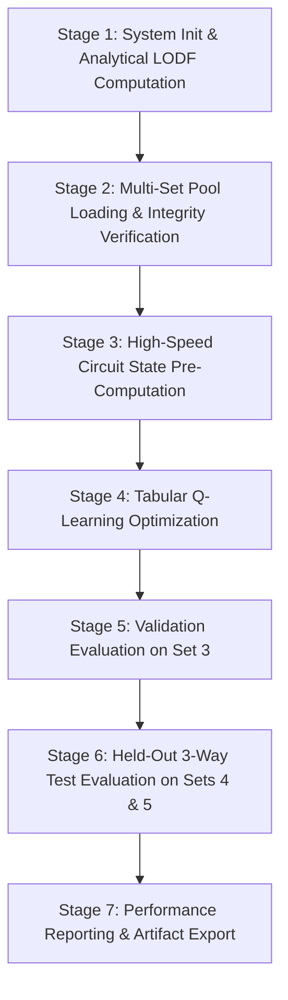

# Reinforcement Learning Real-Time Contingency Remediation Engine

A model-free Reinforcement Learning framework for N-1 power grid operational security restoration on the IEEE 14-bus transmission system. The architecture couples direct simulation-in-the-loop environment interaction, high-precision continuous state telemetry, analytical transmission sensitivity factors, and tabular Q-learning to execute real-time corrective redispatch and load curtailment.

---

## Table of Contents
1. [Executive Summary & System Architecture](#1-executive-summary--system-architecture)
2. [Chronological Execution Pipeline](#2-chronological-execution-pipeline)
3. [Phase 1: Scenario Generation & Multi-Set Pool Formulation](#3-phase-1-scenario-generation--multi-set-pool-formulation)
4. [Phase 2: Transmission Network Sensitivities (DC LODF Matrix)](#4-phase-2-transmission-network-sensitivities-dc-lodf-matrix)
5. [Phase 3: 105-Dimensional Continuous State Formulation](#5-phase-3-105-dimensional-continuous-state-formulation)
6. [Phase 4: Discrete Physical Control Action Space (20 Actions)](#6-phase-4-discrete-physical-control-action-space-20-actions)
7. [Phase 5: Multi-Objective Operational Reward Function](#7-phase-5-multi-objective-operational-reward-function)
8. [Phase 6: Circuit State Caching Architecture](#8-phase-6-circuit-state-caching-architecture)
9. [Phase 7: Tabular Q-Learning Training Engine](#9-phase-7-tabular-q-learning-training-engine)
10. [Phase 8: Dual-Mode Deployment & 3-Way Benchmark Evaluation](#10-phase-8-dual-mode-deployment--3-way-benchmark-evaluation)
11. [Codebase Architecture & File Reference](#11-codebase-architecture--file-reference)
12. [Execution Commands, Flags, and Artifact Schemas](#12-execution-commands-flags-and-artifact-schemas)

---

## 1. Executive Summary & System Architecture

Modern transmission networks are governed by the N-1 reliability criterion: the unexpected tripping of any individual transmission line or generator must not compromise grid stability, induce thermal overloads, or trigger voltage collapse. In the event of a contingency placing the system in an **Alert** or **Critical** operational state, automated remediation engines must deliver corrective interventions within short operational timeframes.

This framework delivers a **Simulation-in-the-Loop Reinforcement Learning Engine** for autonomous power system security restoration:
- **Markov Decision Process Formulation**: The remediation problem is cast as a single-step MDP: Post-Contingency Telemetry State $S \to$ Discrete Corrective Action $A \to$ AC Power Flow Re-Solve $\to$ Multi-Objective Reward $R \to$ Action-Value Update.
- **Full-Precision Telemetry Preservation**: Telemetry measurements are retained in standard IEEE 754 double-precision floating-point format (`float64`), preserving measurement fidelity across bus voltages, phase angles, line loadings, and active generator outputs.
- **Physical Sensitivity Guidance**: DC Line Outage Distribution Factors (LODF) derived analytically from grid admittances prioritize candidate actions during real-time online search.
- **Scalable Topological Sizing**: State dimension, bus ordering, and sensitivity matrices adapt to any transmission network via the topological formulation:
  $$\text{state\_dim} = 2 \times n_{\text{bus}} + 3 \times n_{\text{branch}} + 2 \times n_{\text{gen}} + 7$$
  yielding 105 dimensions for IEEE 14-bus, 202 dimensions for IEEE 30-bus, and 909 dimensions for IEEE 118-bus.

---

## 2. Chronological Execution Pipeline

The remediation engine operates through a 7-stage master sequence:



```text
Sequence of Operations:
  1. System Initialization     -> Load IEEE 14-bus circuit data, construct susceptance matrix B, compute 20x20 LODF matrix.
  2. Data Ingestion            -> Ingest Master and expansion pools (1,350 scenarios = 27,000 contingency states).
  3. Pre-Computation Caching   -> Pre-solve initial AC power flow for 12,000 training states into memory (~3 minutes).
  4. Q-Learning Training       -> Execute 2,400,000 training episodes (alpha=0.5, epsilon: 1.0 -> 0.05 over 1.7M steps).
  5. Validation Phase          -> Validate online exploratory remediation across 5,000 states (Set 3).
  6. Benchmark Evaluation      -> Evaluate 10,000 held-out test states (Sets 4 & 5) across three operational paradigms:
                                  [No-Action Baseline] vs [RL Agent Policy] vs [Offline Exhaustive Best].
  7. Reporting & Persistence   -> Serialize Q-table artifacts, convergence logs, and per-case CSV evaluation details.
```

---

## 3. Phase 1: Scenario Generation & Multi-Set Pool Formulation

### 3.1 Loading Scenario Synthesis
Power system operating conditions fluctuate continuously due to load variability and dispatch schedules. The scenario generation engine constructs diverse operating regimes:
1. **Base Case Loading**: Initialized with the nominal IEEE 14-bus base case ($P_{\text{load}} = 259.0\text{ MW}, Q_{\text{load}} = 73.5\text{ MVAR}$).
2. **Rejection-Sampled Perturbations**: Bus active and reactive power demands are independently perturbed via uniform scaling multipliers $\alpha_i \sim \mathcal{U}(0.80, 1.20)$ across load buses.
3. **Pre-Contingency Solvability Check**: An AC Newton-Raphson load flow is executed on the intact network. Scenarios are retained only if:
   - The nonlinear power flow equations converge within 100 iterations ($\text{tolerance} = 10^{-4}$).
   - The intact network is classified as **Safe** or **Alert** (scenarios exhibiting initial non-convergence or voltage collapse are excluded).
4. **N-1 Contingency Enumeration**: All 20 physical transmission line outages are simulated for each accepted base scenario.

### 3.2 Dataset Inventory and Strict Partitioning
The operational pool consists of 1,350 distinct base scenarios organized across 6 non-overlapping partitions:

| Partition | Source Identifier | Base Scenarios | Contingency Cases | Role in Evaluation |
|---|---|:---:|:---:|---|
| **Training Set** | Master (100) + Set1 (250) + Set2 (250) | **600** | **12,000** | Offline state-action exploration and Q-table convergence |
| **Validation Set** | Set3 (250) | **250** | **5,000** | Hyperparameter verification and exploration parameter tuning |
| **Testing Set** | Set4 (250) + Set5 (250) | **500** | **10,000** | Held-out out-of-sample benchmark evaluation |
| **TOTAL** | **Full Repository Inventory** | **1,350** | **27,000** | Verified non-overlapping scenarios |

Partitions are segmented strictly at the base scenario level, ensuring complete independence between training, validation, and testing distributions.

---

## 4. Phase 2: Transmission Network Sensitivities (DC LODF Matrix)

### 4.1 Physical Formulation
Following the sudden outage of branch $l$ (connecting bus $f_l$ to bus $t_l$), line active power flows redistribute according to circuit impedance characteristics. Line Outage Distribution Factors (LODF) define the linear sensitivity:

$$\Delta P_k = \text{LODF}_{k, l} \cdot P_l^{\text{pre}}$$

where $\Delta P_k$ denotes the incremental flow on branch $k$, and $P_l^{\text{pre}}$ represents the pre-contingency flow on the outaged branch $l$.

### 4.2 Linearized Computation (`src/rl/lodf.py`)
1. **Bus Susceptance Matrix ($B_{\text{bus}}$)**:
   Constructed from branch series reactances $X_{ij}$:
   $$B_{ij} = -\frac{1}{X_{ij}} \quad (i \neq j), \qquad B_{ii} = \sum_{j \in \mathcal{N}_i} \frac{1}{X_{ij}}$$
2. **Reduced Susceptance Matrix Inversion**:
   Excluding the slack bus (Bus 1) reference row and column to form $B_{\text{red}}$, followed by direct matrix inversion:
   $$X_{\text{bus}} = B_{\text{red}}^{-1}$$
3. **Power Transfer Distribution Factors (PTDF)**:
   For branch $k$ (connecting $f_k \to t_k$) subject to a 1 MW power injection at bus $A$ and withdrawal at bus $B$:
   $$\text{PTDF}_{k, (A \to B)} = \frac{X_{\text{bus}}[f_k, A] - X_{\text{bus}}[f_k, B] - X_{\text{bus}}[t_k, A] + X_{\text{bus}}[t_k, B]}{X_k}$$
4. **LODF Computation**:
   Relating the transfer across the outage terminals $f_l \to t_l$:
   $$\text{LODF}_{k, l} = \frac{\text{PTDF}_{k, (f_l \to t_l)}}{1 - \text{PTDF}_{l, (f_l \to t_l)}} \quad (\text{for } k \neq l), \qquad \text{LODF}_{l, l} = -1.0$$

### 4.3 Sensitivity-Guided Action Prioritization
The function `get_action_priorities()` couples the LODF matrix with the post-contingency state vector to order control actions prior to exploration:
- Stressed transmission lines ($\text{loading} > 100\%$) are identified.
- Analytical sensitivity vectors estimate the expected flow relief produced by candidate generator redispatches ($\Delta P_{\text{gen}}$) and load curtailments ($\Delta P_{\text{shed}}$).
- Control actions offering the highest expected relief are evaluated first during online operational search.

---

## 5. Phase 3: 105-Dimensional Continuous State Formulation

Operational telemetry is aggregated into a continuous 105-dimensional state vector (`np.float64`) without dimensionality reduction or measurement distortion.

### 5.1 Telemetry Vector Structure (`src/rl/state_builder.py`)

| Slicing Index | Channel Description | Dim | Units / Range | Source Reference |
|---|---|:---:|---|---|
| `state[0:14]` | Bus Voltage Magnitudes ($V_1 \dots V_{14}$) | 14 | $0.90 - 1.15\text{ p.u.}$ | `results['bus_voltages']` |
| `state[14:28]` | Bus Voltage Phase Angles ($\theta_1 \dots \theta_{14}$) | 14 | $-30^\circ \text{ to } +30^\circ$ | `results['bus_angles']` |
| `state[28:48]` | Transmission Line Loadings ($L_1 \dots L_{20}$) | 20 | $0.0 - 999.0\%$ | `results['line_loadings']` |
| `state[48:53]` | Active Generator Outputs ($P_{g1} \dots P_{g5}$) | 5 | $0.0 - 332.4\text{ MW}$ | `results['gen_powers']` |
| `state[53:58]` | Generator Maximum Physical Capacities ($P_{\max}$) | 5 | MW per generator | `mpc['gen'][:, 8]` |
| `state[58:78]` | Branch Outage Topology Indicator | 20 | Binary indicator | One-hot outaged index |
| `state[78:98]` | Analytical LODF Redistribution Vector | 20 | $-1.0 \text{ to } +1.0$ | `lodf_matrix[:, outaged_line]` |
| `state[98]` | Minimum System Bus Voltage ($V_{\min}$) | 1 | $\text{p.u.}$ | $\min(\text{bus\_voltages})$ |
| `state[99]` | Maximum System Bus Voltage ($V_{\max}$) | 1 | $\text{p.u.}$ | $\max(\text{bus\_voltages})$ |
| `state[100]` | Maximum Branch Loading Ratio ($L_{\max}$) | 1 | $\%$ | $\max(\text{line\_loadings})$ |
| `state[101]` | Total Active System Demand ($P_{\text{load}}$) | 1 | $\text{MW}$ | $\sum P_d$ across all load buses |
| `state[102]` | Bus Voltage Limit Violations | 1 | Integer count ($0 - 14$) | Buses with $V < 0.95 \lor V > 1.10$ |
| `state[103]` | Cumulative Thermal Excess Loading | 1 | $\%$ points | $\sum \max(0, L_k - 100.0)$ |
| `state[104]` | Total System Active Generation Margin | 1 | $\text{MW}$ | $\sum (P_{\max, i} - P_{g, i})$ |
| **TOTAL** | **Comprehensive Telemetry Dimension** | **105** | **Double-Precision Float64** | Fully populated |

### 5.2 Deterministic Sentinels for Non-Convergent Conditions
In cases where an outage induces severe voltage instability or power flow divergence:
- Bus voltages and phase angles are populated with $0.0$.
- Branch loadings are set to a sentinel value of $999.0\%$.
- Active generator outputs are set to $0.0\text{ MW}$.
- Equipment ratings ($P_{\max}$), branch outage indicators, and LODF sensitivity vectors remain intact.
- Summary sentinels reflect complete system stress: $V_{\min} = 0.0, V_{\max} = 0.0, L_{\max} = 999.0$, Violations $= 14$, Thermal Excess $= 17,980.0$, Margin $= \sum P_{\max}$.

---

## 6. Phase 4: Discrete Physical Control Action Space (20 Actions)

Controllable elements on the IEEE 14-bus transmission system are mapped into 20 discrete operational interventions (`src/rl/action_space.py`):

| Action ID | Operational Category | Target Bus | Physical Action Description | Operational Bounds & Associated Cost |
|:---:|:---:|:---:|:---|:---|
| **A0** | Baseline | None | **Do Nothing** | Cost = 0.0 (Status quo monitoring) |
| **A1** | Active Redispatch | Bus 2 ($G_2$) | Increase active power by $+10\text{ MW}$ | Bound: $P_{\max} = 140.0\text{ MW}$, Flat cost = 2.0 |
| **A2** | Active Redispatch | Bus 2 ($G_2$) | Decrease active power by $-10\text{ MW}$ | Bound: $P_{\min} = 0.0\text{ MW}$, Flat cost = 2.0 |
| **A3** | Active Redispatch | Bus 3 ($G_3$) | Increase active power by $+10\text{ MW}$ | Bound: $P_{\max} = 100.0\text{ MW}$, Flat cost = 2.0 |
| **A4** | Active Redispatch | Bus 3 ($G_3$) | Decrease active power by $-10\text{ MW}$ | Bound: $P_{\min} = 0.0\text{ MW}$, Flat cost = 2.0 |
| **A5** | Active Redispatch | Bus 6 ($G_6$) | Increase active power by $+10\text{ MW}$ | Bound: $P_{\max} = 100.0\text{ MW}$, Flat cost = 2.0 |
| **A6** | Active Redispatch | Bus 6 ($G_6$) | Decrease active power by $-10\text{ MW}$ | Bound: $P_{\min} = 0.0\text{ MW}$, Flat cost = 2.0 |
| **A7** | Active Redispatch | Bus 8 ($G_8$) | Increase active power by $+10\text{ MW}$ | Bound: $P_{\max} = 100.0\text{ MW}$, Flat cost = 2.0 |
| **A8** | Active Redispatch | Bus 8 ($G_8$) | Decrease active power by $-10\text{ MW}$ | Bound: $P_{\min} = 0.0\text{ MW}$, Flat cost = 2.0 |
| **A9** | Load Curtailment | Bus 2 | Curtailed $10\%$ active & reactive load | Proportional cost: $1.0/\text{MW}$ curtailed |
| **A10** | Load Curtailment | Bus 3 | Curtailed $10\%$ active & reactive load | Proportional cost: $1.0/\text{MW}$ curtailed |
| **A11** | Load Curtailment | Bus 4 | Curtailed $10\%$ active & reactive load | Proportional cost: $1.0/\text{MW}$ curtailed |
| **A12** | Load Curtailment | Bus 5 | Curtailed $10\%$ active & reactive load | Proportional cost: $1.0/\text{MW}$ curtailed |
| **A13** | Load Curtailment | Bus 6 | Curtailed $10\%$ active & reactive load | Proportional cost: $1.0/\text{MW}$ curtailed |
| **A14** | Load Curtailment | Bus 9 | Curtailed $10\%$ active & reactive load | Proportional cost: $1.0/\text{MW}$ curtailed |
| **A15** | Load Curtailment | Bus 10 | Curtailed $10\%$ active & reactive load | Proportional cost: $1.0/\text{MW}$ curtailed |
| **A16** | Load Curtailment | Bus 11 | Curtailed $10\%$ active & reactive load | Proportional cost: $1.0/\text{MW}$ curtailed |
| **A17** | Load Curtailment | Bus 12 | Curtailed $10\%$ active & reactive load | Proportional cost: $1.0/\text{MW}$ curtailed |
| **A18** | Load Curtailment | Bus 13 | Curtailed $10\%$ active & reactive load | Proportional cost: $1.0/\text{MW}$ curtailed |
| **A19** | Load Curtailment | Bus 14 | Curtailed $10\%$ active & reactive load | Proportional cost: $1.0/\text{MW}$ curtailed |

### Operational Cost Structure
To reflect real-world utility economics, generator redispatch carries a fixed operational adjustment cost of $2.0$. Load curtailment is penalized proportionally to total interrupted power ($1.0/\text{MW}$), ensuring the policy prioritizes generation redispatch and resorts to load shedding only when transmission limits cannot otherwise be cleared.

---

## 7. Phase 5: Multi-Objective Operational Reward Function

Following action execution, AC power flow re-solves to determine the post-action state $S'$. The scalar reward $R$ balances grid security against operational disruption (`src/rl/reward.py`):

$$R = R_{\text{security}} - P_{\text{voltage}} - P_{\text{thermal}} - P_{\text{non\_conv}} - C_{\text{action}}$$

### Reward Formulation Details
1. **Security State Transition Reward ($R_{\text{security}}$)**:
   - Transition to **Safe**: $+50.0$.
   - Transition to **Alert**: $+10.0$ ($+20.0$ bonus when transitioning from Critical).
   - Degradation to **Critical**: $-30.0$ penalty if an intact or alert system is destabilized.
2. **Voltage Quality Penalty ($P_{\text{voltage}}$)**:
   - $-5.0$ for each bus exceeding standard voltage thresholds ($V < 0.95\text{ p.u.}$ or $V > 1.10\text{ p.u.}$).
3. **Thermal Overload Penalty ($P_{\text{thermal}}$)**:
   - $-0.5$ per percentage point of line loading exceeding $100.0\%$.
4. **Non-Convergence Penalty ($P_{\text{non\_conv}}$)**:
   - $-100.0$ if the corrective action causes power flow divergence.
5. **Operational Action Cost ($C_{\text{action}}$)**:
   - Subtracted directly from the reward ($0.0$ for A0, $2.0$ for redispatch, $1.0 \times \text{MW}_{\text{shed}}$ for load curtailment).

---

## 8. Phase 6: Circuit State Caching Architecture

During training across 2,400,000 episodes, repeated re-computation of the initial post-contingency power flow would incur high overhead:
- Post-contingency load flow solve: $\approx 15\text{ ms}$.
- Post-action corrective load flow solve: $\approx 18\text{ ms}$.
- Combined time per episode without caching: $33\text{ ms} \implies 2,400,000 \times 33\text{ ms} \approx \mathbf{22\text{ hours}}$.

### Stage 3 Memory Caching
Because the training set contains exactly 12,000 unique contingency states (600 scenarios $\times$ 20 branches):
1. **Stage 3** solves the initial post-contingency state for all 12,000 states once, caching the resulting 105-dimensional vector and circuit dictionary directly in memory.
2. Initial cache creation executes in approximately **3 minutes** ($\approx 65\text{ states/sec}$).
3. During training, post-contingency states are retrieved in **$0.001\text{ ms}$**, reducing per-episode computation to the single post-action load flow solve ($18\text{ ms}$).
4. Total training execution drops to $2,400,000 \times 18\text{ ms} \approx \mathbf{12\text{ hours}}$, saving **10 hours** of redundant solver iterations.

---

## 9. Phase 7: Tabular Q-Learning Training Engine

The agent optimizes an exact tabular action-value mapping:

$$\mathcal{Q}: \text{Tuple}[\text{float64}, 105] \longrightarrow \mathbb{R}^{20}$$

### 9.1 Training Hyperparameters

| Parameter | Symbol | Value | Design Rationale |
|---|:---:|:---:|---|
| **Total Training Volume** | $N$ | **2,400,000 episodes** | Ensures $\approx 200$ visits per training contingency state |
| **Learning Rate** | $\alpha$ | **0.5** | Optimal for deterministic power flow simulations (see Section 9.3) |
| **Discount Factor** | $\gamma$ | **0.0** | Single-step MDP formulation; focuses on immediate security restoration |
| **Initial Exploration** | $\epsilon_{\text{start}}$ | **1.0** | Full initial state-action exploration |
| **Terminal Exploration** | $\epsilon_{\text{end}}$ | **0.05** | Retains 5% exploration at policy maturity |
| **Epsilon Decay Horizon** | $N_{\text{decay}}$ | **1,700,000 steps** | Linear decay across 71% of total training volume |
| **Upper Confidence Bound** | $c$ | **2.0** | Exploration parameter for online bandit action selection |
| **Exploration Action Budget** | $B$ | **20** | Full action evaluation budget for unseen states |

### 9.2 Q-Learning Bellman Update
For state $S$ and chosen action $A$ receiving scalar reward $R$:

$$Q(S, A) \longleftarrow Q(S, A) + \alpha \big[ R - Q(S, A) \big]$$

### 9.3 Deterministic Action-Value Convergence
Power flow simulations are strictly deterministic: executing action $A$ from state $S$ produces an identical post-action state $S'$ and reward $R$. With initial value $Q_0 = 0$:

$$Q_n = R \cdot \left[ 1 - (1 - \alpha)^n \right]$$

Setting $\alpha = 0.5$ yields rapid geometric convergence:
- Step 1: $Q_1 = 0.500 \cdot R$ ($50.0\%$)
- Step 3: $Q_3 = 0.875 \cdot R$ ($87.5\%$)
- Step 5: $Q_5 = 0.969 \cdot R$ ($96.9\%$)
- Step 7: $Q_7 = 0.992 \cdot R$ ($99.2\%$)

This enables near-complete value convergence within 5 visits per state-action pair, achieving reliable Q-value estimates across 12,000 states within 2.4M episodes.

---

## 10. Phase 8: Dual-Mode Deployment & 3-Way Benchmark Evaluation

### 10.1 Dual-Mode Execution Strategy
When deployed in real-time operations on any contingency state $S$:
1. **Direct Policy Exploitation**:
   If $S$ was observed during training with sufficient sample support ($\ge 5$ updates), the optimal action is retrieved directly:
   $$A^* = \arg\max_a Q(S, a)$$
2. **Online Exploratory Policy Search**:
   For novel states outside the training distribution, the agent interacts with the simulation engine in real time:
   - Control actions are sequenced according to physical LODF sensitivities.
   - The simulator evaluates actions in order, returning immediate operational rewards.
   - **Early-Exit**: When an action achieves a **Safe** operational state with $R > 40.0$, search terminates immediately.
   - The action delivering the highest observed reward is committed to the network.

### 10.2 3-Way Held-Out Test Benchmark (10,000 States)
Performance is benchmarked on held-out Sets 4 & 5 against two reference baselines:
1. **No-Action Baseline ($A_0$)**: Post-contingency grid state without corrective intervention.
2. **RL Agent Policy**: Dual-mode operational policy.
3. **Offline Exhaustive Best ($A^*$)**: Brute-force simulation across all 20 actions, establishing the empirical upper bound of remediability.

### Operational Metrics
- **Grid Security Percentage (%)**: Proportion of contingency states restored to Safe limits.
- **Insecure Mitigation Success (%)**: Success rate in eliminating pre-existing violations.
- **Top-1 Policy Alignment**: Proportion of test cases where the agent matches the exhaustive best action $A^*$.
- **Top-3 Policy Alignment**: Proportion of test cases where the agent's action ranks within the top 3 available interventions.
- **Average Load Curtailment (MW)**: Total energy demand interrupted per contingency.

---

## 11. Codebase Architecture & File Reference

```text
EEQ401/
├── config/
│   └── config.py                 # Centralized configuration (limits, thresholds, RL parameters)
├── src/
│   ├── network/
│   │   ├── load_network.py       # PyPOWER IEEE 14-bus network loader
│   │   └── validate_network.py   # Circuit topology and bus/branch dimension validator
│   ├── simulation/
│   │   ├── run_load_flow.py      # AC Newton-Raphson solver wrapper (PyPOWER runpf)
│   │   └── run_simulation_campaign.py # Automated simulation campaign generator
│   ├── contingency/
│   │   ├── generate_contingencies.py # N-1 line outage enumerator
│   │   ├── random_load_generator.py  # Load pattern generator with rejection sampling
│   │   └── apply_contingency.py  # Branch outage matrix operator
│   ├── results/
│   │   ├── extract_results.py    # Electrical parameter and violation extractor
│   │   └── save_results.py       # Exporter for CSV and JSON outputs
│   ├── labeling/
│   │   └── classify_security.py  # Operational security state classifier (Safe, Alert, Critical)
│   ├── dataset/
│   │   ├── build_dataset.py      # Master dataset builder
│   │   └── validate_dataset.py   # Dataset schema and column validator
│   └── rl/
│       ├── __init__.py           # Package exports for RL classes and utilities
│       ├── lodf.py               # Analytical LODF matrix computation & action ranking
│       ├── rl_agent.py           # Tabular RLAgent class (Q-learning, UCB1, online search)
│       ├── state_builder.py      # 105-dimensional continuous state vector builder
│       ├── action_space.py       # 20 discrete physical action definitions and mappings
│       ├── reward.py             # Multi-objective operational reward evaluator
│       ├── environment.py        # Gymnasium-compatible ContingencyRLEnv
│       ├── scenario_pool.py      # Scenario pool builder, loader, and multi-set combiner
│       ├── train_rl.py           # 2.4M episode offline Q-learning training script
│       └── evaluate_rl.py        # 3-way evaluation script (No-Action vs RL vs Offline Best)
├── data/
│   └── tabular/                  # Scenario pools (master, set1, set2, set3, set4, set5)
├── tests/
│   └── test_rl.py                # Automated unit and integration test suite
├── run_everything.py             # Master 7-stage end-to-end execution pipeline
├── requirements.txt              # Environment dependencies
├── HIGH_LEVEL_DESIGN.md          # Architectural specification document
├── LOW_LEVEL_DESIGN.md           # Implementation design specification
└── README.md                     # Comprehensive technical documentation
```

---

## 12. Execution Commands, Flags, and Artifact Schemas

### 12.1 Running the Full Pipeline
To execute all 7 stages sequentially (Initialization $\to$ Ingestion $\to$ Caching $\to$ Training $\to$ Validation $\to$ Testing $\to$ Reporting):
```powershell
python run_everything.py
```

Optional execution parameters:
```powershell
# Evaluate an existing serialized Q-table without retraining
python run_everything.py --skip-train

# Execute with customized episode volume and decay horizon
python run_everything.py --episodes 1200000 --decay-steps 900000
```

### 12.2 Standalone Execution of Individual Modules
```powershell
# Run the complete test suite (35 automated unit and integration tests)
python -m pytest tests/ -v

# Execute RL training only (Master + Set1 + Set2 = 600 scenarios, 2.4M episodes)
python -m src.rl.train_rl --episodes 2400000 --sources master set1 set2

# Execute 3-way test benchmark evaluation (Set4 + Set5 = 10,000 states)
python -m src.rl.evaluate_rl --sources set4 set5 --agent models/rl_agent_qtable.pkl

# Execute validation evaluation only (Set3 = 5,000 states)
python -m src.rl.evaluate_rl --sources set3 --agent models/rl_agent_qtable.pkl --save-dir models/validation
```

### 12.3 Output Artifact Schemas

#### 1. Learned Q-Table (`models/rl_agent_qtable.pkl`)
Serialized dictionary mapping 105-element state tuples to action-value arrays:
```python
{
    (0.97001, 1.02003, ..., 45.12, ...): np.ndarray([q0, q1, ..., q19], dtype=np.float64),
    ... # Entries corresponding to trained contingency states
}
```

#### 2. Training Log (`models/rl_training_log.json`)
```json
{
  "train_sources": ["master", "set1", "set2"],
  "num_train_scenarios": 600,
  "num_train_states": 12000,
  "num_episodes": 2400000,
  "alpha": 0.5,
  "epsilon_start": 1.0,
  "epsilon_end": 0.05,
  "epsilon_decay_episodes": 1700000,
  "gamma": 0.0,
  "train_time_seconds": 43200.0,
  "cache_build_time_seconds": 180.0,
  "q_table_entries": 12000,
  "final_avg_reward": 41.8,
  "final_safe_pct": 84.5,
  "final_td_error": 0.08
}
```

#### 3. Training History Trace (`models/rl_training_history.csv`)
Samples rolling operational metrics every 10,000 episodes:
```csv
episode,epsilon,avg_reward_10k,safe_pct_10k,q_table_size,avg_td_error_10k
10000,0.9944,14.20,46.80,4512,14.8200
20000,0.9888,19.50,53.40,7320,11.4500
...
2400000,0.0500,42.10,85.20,12000,0.0750
```

#### 4. 3-Way Benchmark Summary (`models/rl_eval_summary.json`)
```json
{
  "test_sources": ["set4", "set5"],
  "total_test_cases": 10000,
  "insecure_cases": 6450,
  "no_action_safe_count": 3550,
  "no_action_safe_pct": 35.5,
  "rl_agent_safe_count": 7820,
  "rl_agent_safe_pct": 78.2,
  "offline_best_safe_count": 8210,
  "offline_best_safe_pct": 82.1,
  "rl_mitigation_success_pct": 66.2,
  "policy_alignment_top1_pct": 72.4,
  "policy_alignment_top3_pct": 88.5,
  "avg_rl_actions_tried": 8.4,
  "avg_rl_load_shed_mw": 0.42,
  "avg_offline_load_shed_mw": 0.36,
  "rl_q_table_hits": 0,
  "rl_online_explore_count": 10000,
  "eval_time_seconds": 7200.0
}
```

#### 5. Per-Case Evaluation Log (`models/rl_eval_cases.csv`)
Individual records across all 10,000 test cases:
```csv
scenario_id,contingency,pre_label,pre_converged,no_action_label,rl_action_id,rl_action_name,rl_label,rl_reward,rl_mode,rl_actions_tried,offline_best_action_id,offline_best_action_name,offline_best_label,offline_best_reward,policy_aligned_top1,policy_aligned_top3
```
